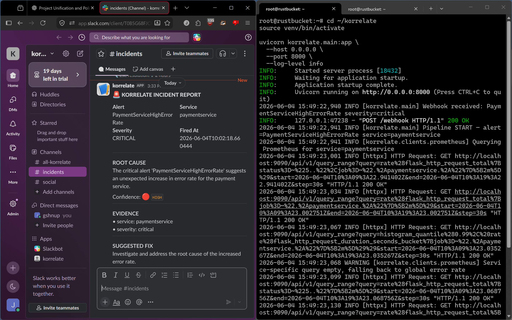
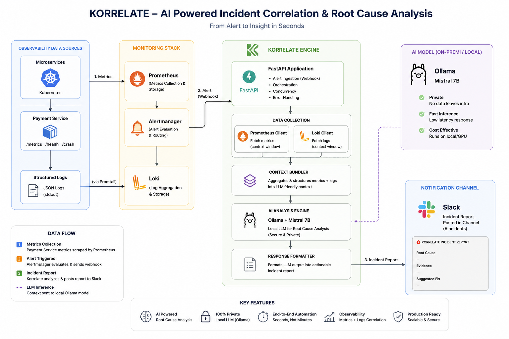
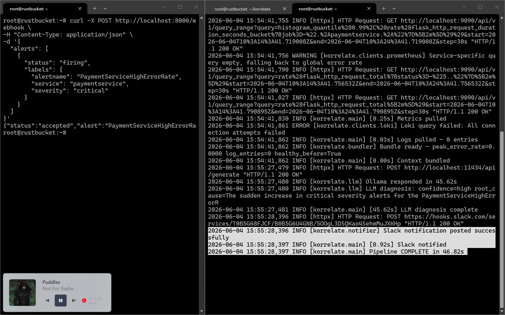

# Korrelate

> Alerts tell you something is broken.
> Korrelate tries to tell you why.

Korrelate is an AI-powered incident investigation engine that automatically gathers metrics, correlates logs, generates a root-cause hypothesis, and delivers a structured incident report to Slack.

Instead of forwarding raw alerts to engineers, Korrelate performs the first stage of the investigation automatically.

Built with Kubernetes, Prometheus, Loki, FastAPI, Terraform, and a locally hosted Mistral 7B model running through Ollama.

---

## A Real Incident Report



When an alert fires, Korrelate produces:

* Root cause hypothesis
* Confidence assessment
* Supporting evidence
* Recommended next actions

The goal is not to replace engineers.

The goal is to eliminate the first 15 minutes of incident investigation.

---

## Why I Built This

Most observability pipelines stop at detection.

```text
Prometheus
    ↓
Alertmanager
    ↓
Slack
```

The engineer still has to:

* Open dashboards
* Inspect metrics
* Search logs
* Correlate signals
* Form a hypothesis

Korrelate inserts an investigation layer between the alert and the engineer.

```text
Alert
   ↓
Korrelate
   ↓
Evidence Collection
   ↓
AI Analysis
   ↓
Incident Report
```

Instead of receiving an alert, the engineer receives a starting point.

---

## Architecture



---

## End-to-End Flow

```text
Payment Service
        │
        ▼
Prometheus detects abnormal behaviour
        │
        ▼
Alertmanager sends webhook
        │
        ▼
Korrelate receives alert
        │
        ├── Query Prometheus metrics
        ├── Query Loki logs
        ├── Build investigation context
        └── Generate diagnosis using Mistral 7B
        │
        ▼
Slack Incident Report
```

---

## Pipeline Execution



Typical execution path:

```text
Webhook received
      ↓
Metrics collected
      ↓
Logs collected
      ↓
Context bundled
      ↓
LLM diagnosis generated
      ↓
Slack notified
      ↓
Pipeline complete
```

Observed end-to-end execution time:

**40–55 seconds**

---

## Technology Stack

| Layer              | Technology              |
| ------------------ | ----------------------- |
| Infrastructure     | Terraform               |
| Container Platform | Kubernetes (kind / EKS) |
| Monitoring         | Prometheus              |
| Alerting           | Alertmanager            |
| Logging            | Loki + Promtail         |
| Backend            | FastAPI                 |
| AI Inference       | Ollama + Mistral 7B     |
| Notifications      | Slack                   |
| CI                 | GitHub Actions          |

---

## Infrastructure

Terraform definitions are located in:

```text
infra/
```

Provisioned resources:

* VPC
* Public Subnets
* Amazon EKS Cluster
* Managed Node Groups

---

## Repository Structure

```text
korrelate/
├── infra/
├── korrelate/
│   ├── clients/
│   ├── bundler.py
│   ├── llm.py
│   ├── notifier.py
│   └── main.py
├── paymentservice/
├── screenshots/
├── tests/
├── Dockerfile
└── README.md
```

---

## Running Locally

```bash
git clone https://github.com/gshnup/korrelate.git
cd korrelate

cp .env.example .env

pip install -r requirements.txt

ollama pull mistral:7b

uvicorn korrelate.main:app \
  --host 0.0.0.0 \
  --port 8000
```

---

## Key Takeaways

This project involved building across multiple layers of the stack:

* Infrastructure as Code
* Kubernetes operations
* Observability engineering
* Incident response workflows
* LLM integration
* Async Python services
* Alert-driven automation

The biggest lesson was that detecting incidents is only half the problem.

The harder problem is reducing the time between an alert and a useful hypothesis.

---

## Future Improvements

* ArgoCD GitOps deployment
* Redis-backed alert deduplication
* Multi-service incident correlation
* Historical incident knowledge base
* Production-grade EKS deployment
* LLM evaluation framework

---

## License

MIT
