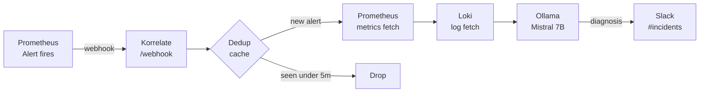

# Korrelate — Open Source AI Incident Correlation Engine

**Alert fires. Root cause in 60 seconds. No cloud LLMs.**

[](https://github.com/YOUR_USERNAME/korrelate/actions/workflows/ci.yml)
[](LICENSE)

---

## Demo


Paymentservice crashes → Korrelate pulls metrics + logs → Mistral 7B diagnoses → Slack card in **42 seconds**. Entirely on-prem.

---

## How It Works



---

## Stack

| Component | Role |
|---|---|
| Prometheus + Alertmanager | Alert detection and routing |
| Loki + Promtail | Log aggregation |
| Ollama + Mistral 7B | Local LLM inference |
| FastAPI | Webhook server and pipeline orchestrator |
| kind | Local Kubernetes cluster |

---

## Quick Start

**Prerequisites**: Docker, kind, kubectl, Python 3.11, [Ollama](https://ollama.ai)

```bash
git clone https://github.com/YOUR_USERNAME/korrelate.git
cd korrelate
cp .env.example .env
# Edit .env — set SLACK_WEBHOOK_URL at minimum
pip install -r requirements.txt
ollama pull mistral:7b
uvicorn korrelate.main:app --host 0.0.0.0 --port 8000
```

---

## Configuration

| Variable | Required | Description |
|---|---|---|
| `SLACK_WEBHOOK_URL` | Yes | Incoming webhook for #incidents |
| `PROMETHEUS_URL` | Yes | Prometheus HTTP API base URL |
| `LOKI_URL` | Yes | Loki HTTP API base URL |
| `OLLAMA_URL` | Yes | Ollama server base URL |
| `OLLAMA_MODEL` | Yes | Model tag (default: mistral:7b) |

---

## Architecture Decisions

- **Ollama over OpenAI** — Zero data egress. Incidents contain PII.
- **Loki over Elasticsearch** — 10x cheaper at small scale. LogQL is readable.
- **FastAPI over Flask** — Native async keeps pipeline non-blocking.
- **kind over minikube** — Multi-node support in CI without a hypervisor.
- **In-memory dedup over Kafka** — Zero dependencies at one-host scale.

---

## Contributing

PRs welcome. One feature per PR. Add a test.

```bash
git clone ...
pip install -r requirements.txt
python -m pytest tests/ -v
```

---

## License

MIT. See [LICENSE](LICENSE).
