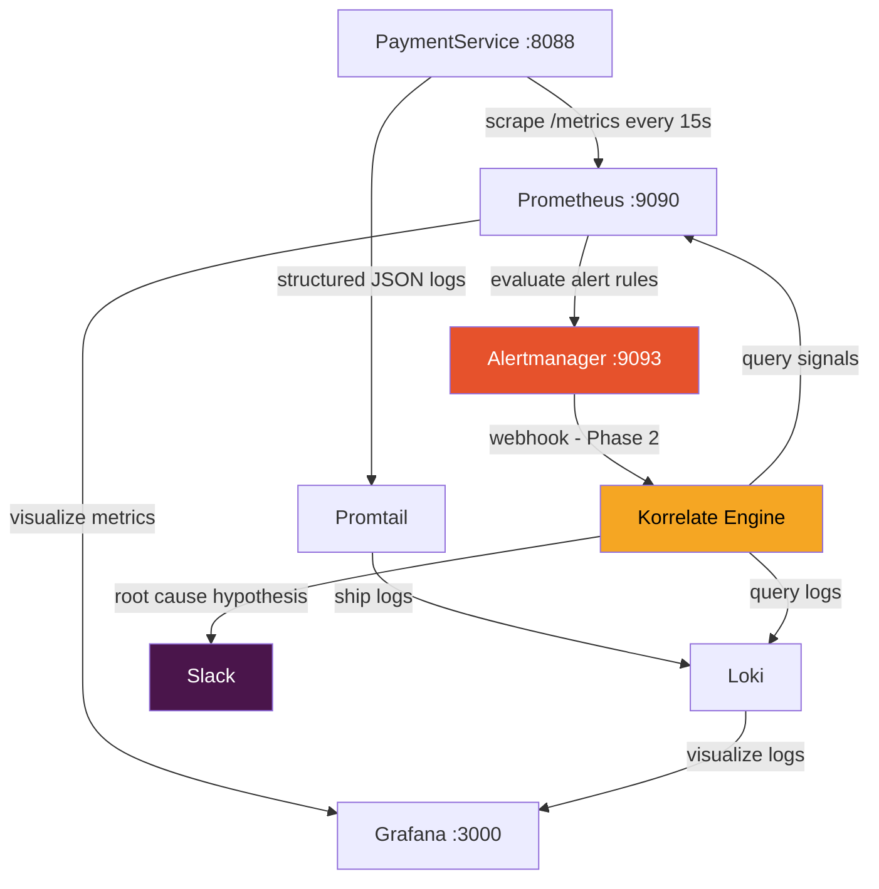

# Korrelate
### AI-Powered Incident Correlation Engine

> Automatically diagnoses production failures by correlating metrics, logs, traces, git commits, and deployment history — then posts a root cause hypothesis to Slack within 60 seconds of an alert firing.


---

## What Problem Phase 1 Solves

When production breaks at 3am, engineers wake up blind. They have to manually:
- Open Grafana to find the metric spike
- Search Loki for relevant error logs
- Cross-reference recent deployments
- Form a hypothesis — all while the incident is live

**Phase 1 builds the foundation** — a fully instrumented local observability stack with a deliberately broken sample app that generates real alerts and logs. This gives Korrelate (Phase 2) the data sources it needs to correlate signals and diagnose incidents automatically.

No more starting from zero when the alarm fires.

---

## Architecture



---

## Stack

| Component | Purpose | Version |
|---|---|---|
| kind | Local Kubernetes cluster | v0.23.0 |
| kube-prometheus-stack | Prometheus + Alertmanager + Grafana | latest |
| Loki | Log aggregation | 2.9.6 (chart 5.47.2) |
| Promtail | Log shipping agent | 3.5.1 |
| paymentservice | Sample broken Flask app | v1 |

---

## Prerequisites

| Tool | Install |
|---|---|
| Docker Desktop (WSL2 mode) | [docker.com/products/docker-desktop](https://www.docker.com/products/docker-desktop) |
| kind | `curl -Lo ./kind https://kind.sigs.k8s.io/dl/v0.23.0/kind-linux-amd64 && chmod +x ./kind && sudo mv ./kind /usr/local/bin/kind` |
| kubectl | `curl -LO "https://dl.k8s.io/release/$(curl -L -s https://dl.k8s.io/release/stable.txt)/bin/linux/amd64/kubectl" && chmod +x kubectl && sudo mv kubectl /usr/local/bin/kubectl` |
| Helm | `curl https://raw.githubusercontent.com/helm/helm/main/scripts/get-helm-3 \| bash` |

> **WSL2 note:** Run all commands inside WSL Ubuntu terminal. Enable Docker Desktop WSL2 integration under Settings → Resources → WSL Integration.

---

## Quick Start

### 1. Clone and setup

```bash
mkdir -p ~/korrelate && cd ~/korrelate
```

### 2. Create the kind cluster

```bash
cat > kind-config.yaml << 'EOF'
kind: Cluster
apiVersion: kind.x-k8s.io/v1alpha4
name: korrelate-dev
nodes:
  - role: control-plane
    kubeadmConfigPatches:
      - |
        kind: InitConfiguration
        nodeRegistration:
          kubeletExtraArgs:
            node-labels: "ingress-ready=true"
    extraPortMappings:
      - containerPort: 30000
        hostPort: 3000
        protocol: TCP
      - containerPort: 30001
        hostPort: 9090
        protocol: TCP
      - containerPort: 30002
        hostPort: 9093
        protocol: TCP
      - containerPort: 30003
        hostPort: 8088
        protocol: TCP
  - role: worker
  - role: worker
EOF

kind create cluster --config kind-config.yaml
```

### 3. Install Prometheus + Alertmanager + Grafana

```bash
helm repo add prometheus-community https://prometheus-community.github.io/helm-charts
helm repo update

kubectl create namespace monitoring

helm install kube-prometheus-stack prometheus-community/kube-prometheus-stack \
  --namespace monitoring \
  --set grafana.adminPassword=korrelate123 \
  --set grafana.service.type=NodePort \
  --set grafana.service.nodePort=30000 \
  --set prometheus.service.type=NodePort \
  --set prometheus.service.nodePort=30001 \
  --set alertmanager.service.type=NodePort \
  --set alertmanager.service.nodePort=30002 \
  --set prometheus.prometheusSpec.ruleNamespaceSelector={} \
  --set prometheus.prometheusSpec.ruleSelector={} \
  --set prometheus.prometheusSpec.serviceMonitorNamespaceSelector={} \
  --set prometheus.prometheusSpec.serviceMonitorSelector={} \
  --wait --timeout 10m
```

### 4. Install Loki + Promtail

```bash
helm repo add grafana https://grafana.github.io/helm-charts
helm repo update

helm install loki grafana/loki \
  --namespace monitoring \
  --version 5.47.2 \
  --set loki.auth_enabled=false \
  --set loki.commonConfig.replication_factor=1 \
  --set loki.storage.type=filesystem \
  --set loki.useTestSchema=true \
  --set singleBinary.replicas=1 \
  --set singleBinary.persistence.enabled=true \
  --set singleBinary.persistence.storageClass=standard \
  --set singleBinary.persistence.size=2Gi \
  --set read.replicas=0 --set write.replicas=0 --set backend.replicas=0 \
  --set monitoring.selfMonitoring.enabled=false \
  --set monitoring.selfMonitoring.grafanaAgent.installOperator=false \
  --set monitoring.lokiCanary.enabled=false \
  --set test.enabled=false --set gateway.enabled=false \
  --timeout 3m

helm install promtail grafana/promtail \
  --namespace monitoring \
  --set config.clients[0].url=http://loki:3100/loki/api/v1/push \
  --timeout 2m
```

### 5. Deploy paymentservice

```bash
mkdir -p ~/korrelate/paymentservice && cd ~/korrelate/paymentservice

# Write app, Dockerfile, and manifests (see /paymentservice directory)
docker build -t paymentservice:v1 .
kind load docker-image paymentservice:v1 --name korrelate-dev
kubectl apply -f deployment.yaml
kubectl rollout status deployment/paymentservice
```

### 6. Apply alert rule

```bash
kubectl apply -f alert-rule.yaml
```

### 7. Trigger and verify

```bash
# Spike errors
for i in $(seq 1 300); do curl -s http://localhost:8088/crash > /dev/null; sleep 0.2; done

# Check alert status
curl -s http://localhost:9090/api/v1/alerts | python3 -c "
import sys,json
d=json.load(sys.stdin)
[print(a['labels']['alertname'], '--', a['state']) for a in d['data']['alerts'] if 'Payment' in a['labels'].get('alertname','')]
"
```

---

## Service URLs

| Service | URL | Credentials |
|---|---|---|
| Grafana | http://localhost:3000 | admin / korrelate123 |
| Prometheus | http://localhost:9090 | — |
| Alertmanager | http://localhost:9093 | — |
| PaymentService | http://localhost:8088 | — |

---

## Verification Checklist

```bash
# Run all checks at once
echo "=== Nodes ===" && kubectl get nodes
echo "=== Monitoring pods ===" && kubectl get pods -n monitoring | grep -v Running | grep -v Completed
echo "=== PaymentService ===" && kubectl get pods -l app=paymentservice
echo "=== Metrics reachable ===" && curl -s http://localhost:8088/metrics | grep "^paymentservice_" | head -3
echo "=== Alert rule loaded ===" && curl -s http://localhost:9090/api/v1/rules | python3 -c "
import sys,json
d=json.load(sys.stdin)
[print('✅', r['name']) for g in d['data']['groups'] for r in g['rules'] if 'Payment' in r['name']]
"
```

- [ ] All 3 nodes show `Ready`
- [ ] No pods in `Error` or `CrashLoopBackOff`
- [ ] Grafana loads at localhost:3000
- [ ] Loki datasource visible in Grafana → Explore
- [ ] `paymentservice_requests_total` metric exists in Prometheus
- [ ] `PaymentServiceHighErrorRate` rule loaded in Prometheus → Alerts tab
- [ ] Alert flips to `firing` after hitting `/crash` for 60+ seconds

---

## Useful Queries

**Prometheus — error rate:**
```promql
rate(paymentservice_requests_total{status_code="500"}[1m])
/
rate(paymentservice_requests_total[1m])
```

**Loki — error logs:**
```logql
{namespace="default"} |= "Cascade failure"
```

---

## Project Structure

```
~/korrelate/
├── kind-config.yaml          # Kubernetes cluster config
├── prometheus-values.yaml    # Prometheus + Grafana Helm values
├── loki-values.yaml          # Loki Helm values
├── loki-datasource.yaml      # Grafana datasource ConfigMap
└── paymentservice/
    ├── app.py                # Flask app with /health /pay /crash /metrics
    ├── requirements.txt
    ├── Dockerfile
    ├── deployment.yaml       # Deployment + Service + ServiceMonitor
    └── alert-rule.yaml       # PrometheusRule — PaymentServiceHighErrorRate
```

---

## Screenshots

> **Grafana Dashboard**
> `[ screenshot — Grafana showing paymentservice error rate spike ]`

> **Alert Firing**
> `[ screenshot — Prometheus Alerts tab showing PaymentServiceHighErrorRate firing ]`

> **Loki Logs**
> `[ screenshot — Grafana Explore showing Cascade failure log stream ]`

---

## What's Next — Phase 2

Phase 1 gives us the data. Phase 2 builds the brain.

| Phase | What Gets Built |
|---|---|
| **Phase 2** | Korrelate engine — receives Alertmanager webhook, queries Prometheus + Loki, calls Claude API, posts root cause to Slack in <60s |
| **Phase 3** | Git + deployment correlation — links incidents to commits and releases |
| **Phase 4** | Trace correlation — integrates with Tempo/Jaeger for distributed tracing |
| **Phase 5** | Production hardening — multi-cluster, real storage, RBAC |

---

*Built with ☕ and too many Helm chart version conflicts.*
